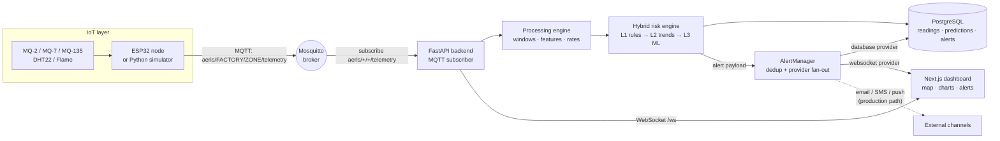
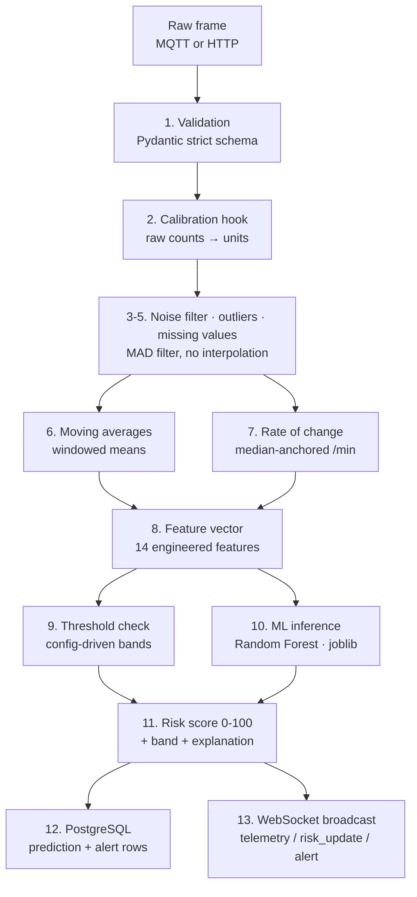
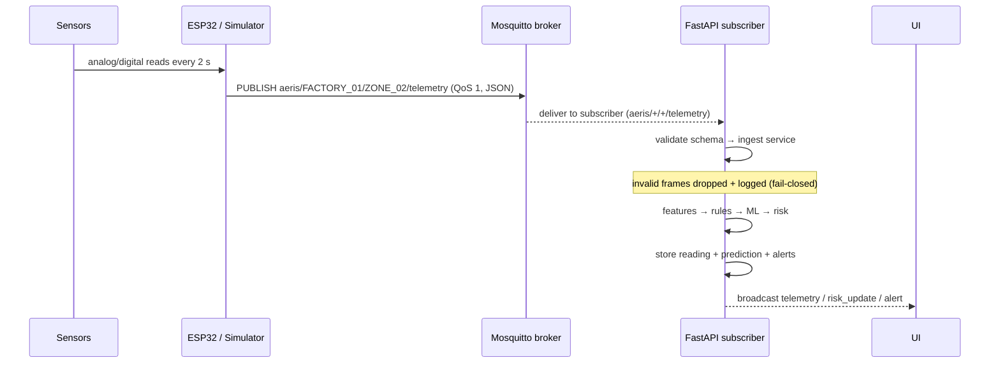
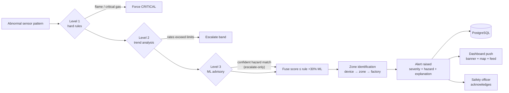
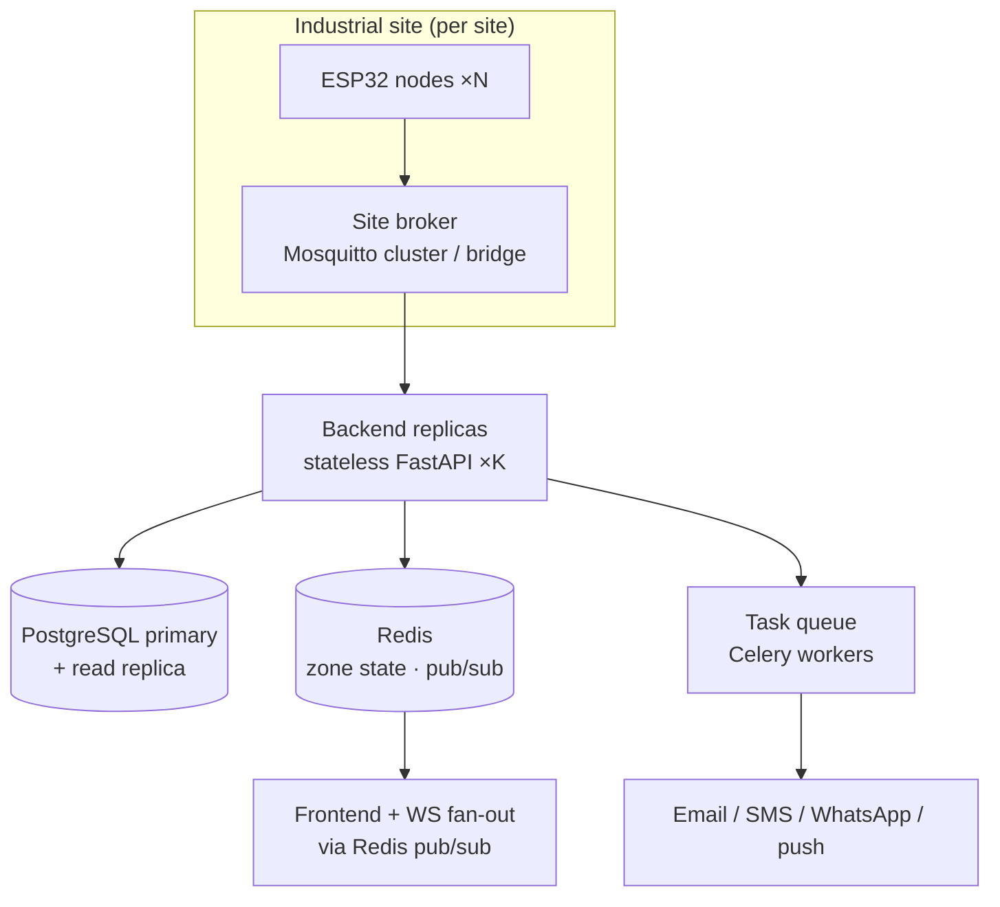

# AERIS Architecture

Mermaid diagrams for the four required views. Everything shown is implemented
in this repository except where explicitly marked *production path*.

## 1. Overall architecture

## 2. Data pipeline (per telemetry frame)

## 3. IoT workflow (device to backend)

## 4. Hazard response flow

## Deployment topology (production path)

